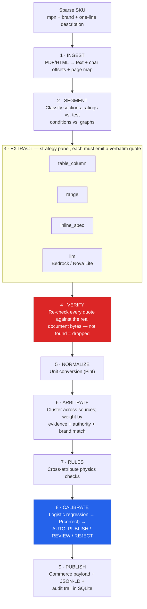
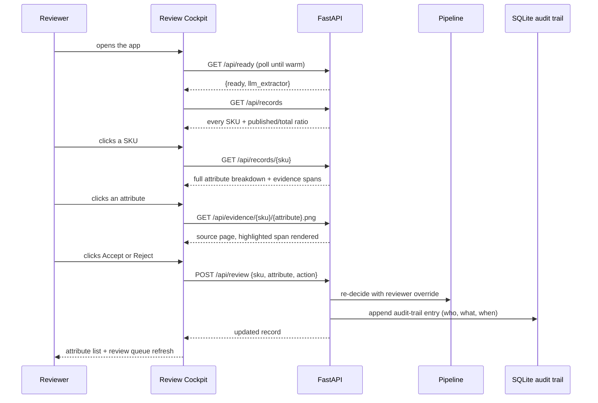

# SpecLedger

**Chain of custody for AI-generated product data.** Every attribute SpecLedger
publishes traces to a highlighted sentence in a real source document, carries a
calibrated confidence score, and auto-publishes only when it is provably safe
to. Where a value can't be verified, the system says so and routes it to a
human — instead of guessing and hoping.

<p>
<a href="https://github.com/adarshcod30/specledger/actions/workflows/ci.yml"></a>


</p>

**Keywords:** `ai` `llm` `evidence-verification` `product-intelligence` `data-enrichment` `human-in-the-loop` `fastapi` `aws-bedrock` `python-library` `open-source`

---

## Table of contents

- [The problem, in one real example](#the-problem-in-one-real-example)
- [Key features](#key-features)
- [Why this repo has two projects in it](#why-this-repo-has-two-projects-in-it)
- [Using SpecLedger as a library](#using-specledger-as-a-library)
- [Part 1 — SpecLedger: verifiable product intelligence](#part-1--specledger-verifiable-product-intelligence)
  - [System architecture](#system-architecture)
  - [What each piece does, and why it exists](#what-each-piece-does-and-why-it-exists)
  - [Application flow — the Review Cockpit request cycle](#application-flow--the-review-cockpit-request-cycle)
  - [How the LLM fits in — and why the architecture doesn't depend on it](#how-the-llm-fits-in--and-why-the-architecture-doesnt-depend-on-it)
  - [Data & ML pipeline](#data--ml-pipeline)
  - [Results, measured](#results-measured)
  - [The Review Cockpit](#the-review-cockpit)
- [Part 2 — A second product domain: Major Appliances](#part-2--a-second-product-domain-major-appliances)
- [Tech stack](#tech-stack)
- [Environment variables and keys](#environment-variables-and-keys)
- [Data map — every file and what's in it](#data-map--every-file-and-whats-in-it)
- [API reference](#api-reference)
- [Setup and running it](#setup-and-running-it)
- [Testing](#testing)
- [Deployment & infrastructure](#deployment--infrastructure)
- [Honest limitations](#honest-limitations)
- [Roadmap](#roadmap)
- [Contributing](#contributing)
- [Repository layout](#repository-layout)
- [License](#license)
- [Contact](#contact)

---

## The problem, in one real example

Vishay's rectifier datasheet tabulates seven part numbers in one row:

```
PARAMETER                              SYMBOL  1N4001 1N4002 1N4003 1N4004 1N4005 1N4006 1N4007  UNIT
Maximum repetitive peak reverse voltage VRRM    50     100    200    400    600    800    1000    V
```

Flattened to text — which is what every naive "read the PDF, ask an LLM"
pipeline does — the part numbers and their values land in **separate rows**.
Get the column wrong and you publish `1000 V` for a `1N4001`, a part rated
`50 V`. Someone puts it on a 600 V rail. It fails short.

That is not a hypothetical. It is in the datasheet this repository actually
downloads and processes. Industrial distributors manage millions of SKUs like
this — cryptic descriptions, scattered manufacturer PDFs, specs that are
safety-critical if wrong — and the review labor to catch every mistake by hand
doesn't scale. **SpecLedger is the layer that decides which AI-generated
values are safe to publish unreviewed, and proves it with a citation.**

## Key features

| Feature | Description |
|---|---|
| **Evidence-gated extraction** | Every candidate value must carry a verbatim quote from the source document; `verify.py` re-checks it against the actual bytes before anything downstream trusts it — a fabricated citation is discarded regardless of how confident the model sounded. |
| **Calibrated confidence, not a model's self-reported score** | A logistic-regression calibrator over 11 evidence features (match quality, source agreement, self-consistency, …) picks an auto-publish threshold that hits a measured precision floor on held-out data, instead of trusting an LLM's own stated confidence (badly calibrated by design). |
| **Selective abstention** | When evidence doesn't clear the bar, the system says so and routes to a human — it never silently guesses to fill a field. |
| **Full audit trail** | Every decision, every reviewer action, timestamped in SQLite — a value can always be traced back to who/what decided it and why. |
| **Deterministic-first extraction panel** | Series-table column resolution, two-ended ranges, and inline label/value parsing run before the LLM ever gets involved — the LLM adds recall, it isn't required for the system to work at all. |
| **Pluggable everything** | Bring your own product schema (`schema.register()`), your own LLM backend (`llm.LLMBackend` Protocol), your own labeled data (`confidence.build_training_set()`) — see [Using SpecLedger as a library](#using-specledger-as-a-library). |
| **Proven on two independent domains** | The same evidence-gate and calibration core runs unmodified against electronic components (this repo's own demo) and Major Appliances (`appliance_catalog/`, with live web sourcing) — not a single-purpose script. |
| **Review Cockpit UI** | A zero-build, single-file web app: click any published value to see the exact highlighted sentence that justifies it, plus a risk-ranked review queue for what didn't auto-publish. |

## Why this repo has two projects in it

| | **SpecLedger** (repo root) | **Appliance catalog module** (`appliance_catalog/`) |
|---|---|---|
| What it is | The core architecture: evidence-gated extraction, source arbitration, calibrated confidence, selective abstention | A real second domain, built by retargeting SpecLedger's proven backend at a completely different kind of product |
| Domain | Electronic components (rectifier diodes, linear regulators) | Major home appliances (dishwashers, washers, dryers, ranges…) |
| Sourcing | Pre-fetched manufacturer PDF datasheets (Vishay, Diodes Inc, Texas Instruments) | **Live** web sourcing — real-time search + fetch against manufacturer sites, at run time |
| Output | A Review Cockpit web app + audit trail in SQLite | A 252-column CSV matching a real distributor's exact Delivery Format schema |
| Ground truth | A 98-label gold set, hand-transcribed from the same PDFs | 2 fully-populated real rows from a real Expected Output file |

`appliance_catalog/extract.py` imports directly from `specledger/llm.py` —
the two projects share one Bedrock/Nova Lite credential path and one
evidence-gate contract. See [How things connect](#how-the-llm-fits-in--and-why-the-architecture-doesnt-depend-on-it).

---

## Using SpecLedger as a library

Both projects above run against a fixed demo corpus. `specledger/` itself
doesn't have to: `pipeline.enrich()` accepts documents you supply directly,
so you can point it at your own catalog instead of forking `corpus.py`.
Everything below runs with no AWS credentials and no network access — the
deterministic extractor panel (`table_column`, `range`, `inline_spec`) needs
neither; the LLM extractor is opt-in, not required.

```bash
pip install -e .
```

```python
from specledger.catalog import InputSKU
from specledger.confidence import ConfidenceModel
from specledger.extract import DETERMINISTIC
from specledger.ingest import IngestedDoc, PageSpan
from specledger.models import SourceDoc
from specledger.pipeline import enrich
from specledger.schema import AttributeSpec, ProductClass, register

# 1. Define what you're extracting -- this is the extension point, additive,
#    no library source to edit.
register(ProductClass(
    key="WIDGET", label="Widget",
    attributes=[AttributeSpec("voltage_rating", "Voltage Rating", "number", "V",
                               required=True, aliases=("Voltage Rating",),
                               plausible_min=1, plausible_max=100)],
))

# 2. Wrap a document you already have as text -- a scraped page, an OCR'd
#    PDF, an HTML datasheet. No corpus.py involved.
text = "ACME WIDGET-9000\nVoltage Rating: 12 V\n"
src = SourceDoc(doc_id="my-doc", url="", publisher="Acme", authority="MFR_DATASHEET",
                 local_path="", sha256="", title="Acme Widget-9000 Datasheet",
                 covers=("WIDGET-9000",))
doc = IngestedDoc(src, text, [PageSpan(page=1, char_start=0, char_end=len(text),
                                        width=0, height=0)])

# 3. Enrich. documents=/known_parts= are what bypass the demo corpus.
sku = InputSKU("SKU-1", "WIDGET-9000", "Acme", "General purpose widget", "WIDGET")
record = enrich(sku, model=ConfidenceModel(), extractors=DETERMINISTIC,
                documents=[doc], known_parts={"WIDGET-9000"})

attr = record.attributes["voltage_rating"]
print(attr.value, attr.unit, attr.decision)        # 12.0 V AUTO_PUBLISH
print(attr.evidence.verified, attr.evidence.quote)  # True 'Voltage Rating: 12 V'
```

That example is [tests/test_library_api.py](tests/test_library_api.py) —
copied from the actual test that runs in CI, not a doc-only snippet that
quietly bit-rots.

A few things worth knowing before you build on this:

- **Your own LLM backend.** `specledger.llm.LLMBackend` is the `Protocol`
  `LLMExtractor` expects — implement `.call(prompt, temperature, *, system=,
  tool_name=, tool_desc=, tool_schema=)` however you like and pass it to
  `panel(backend=your_backend)` or `pipeline.enrich(..., extractors=panel(backend=your_backend))`.
  `specledger.llm.BedrockBackend` is the reference implementation, not a
  requirement — nothing else in the pipeline knows or cares which backend
  produced a candidate, since every candidate is re-verified against the
  document regardless of source.
- **Your own calibrator.** `ConfidenceModel().fit(X, y, safety_mask=...)` is
  already generic; `confidence.build_training_set(rows)` turns your own
  `(ResolvedAttribute, is_correct)` labels into the `(X, y, safety_mask)`
  arrays it wants, so you don't have to reverse-engineer `featurize()`
  yourself. Until you've fit one, `ConfidenceModel()` runs on a readable,
  hand-set cold-start prior instead of failing closed.
- **What you don't get for free.** The document-authenticity guardrails —
  contamination detection, section authority, physics rules — are tuned for
  the two built-in product classes' failure modes. A new domain will surface
  its own version of the "wrong table column" trap this project was built
  around; the evidence-gate and calibration machinery transfers, the
  specific guard heuristics may need their own tuning.

---

## Part 1 — SpecLedger: verifiable product intelligence

### System architecture

A sparse SKU (a part number, a brand, and one marketing line) goes through a
nine-stage pipeline before anything is published. The two stages that carry
the whole trust claim are **VERIFY** (a value survives only if its quote is
found, byte-for-byte, in the actual source document) and **CALIBRATE** (the
publish/review decision comes from a fitted confidence threshold, not a
model's own stated certainty). Everything else — segmentation, normalization,
arbitration, physics rules — exists to feed those two stages better evidence.



The stage-by-stage detail behind that diagram:

- **1 · INGEST** — PDF → text with exact character offsets + page map
  (PyMuPDF). Same char-offset model works for any plain text source — HTML
  included, which is what `appliance_catalog/` reuses it for.
- **2 · SEGMENT** — Datasheets have canonical sections, and each has
  authority over different claims. Absolute Maximum Ratings states ratings;
  Electrical Characteristics states TEST CONDITIONS that look identical but
  aren't; Typical Characteristics is graphs and authorizes nothing at all.
- **3 · EXTRACT** — A panel of strategies, each required to emit a verbatim
  quote: `table_column` resolves WHICH COLUMN of a series table belongs to
  this exact part (defeats the trap above); `range` handles two-ended
  ranges with the unit always coming from the document, never assumed from
  the schema; `inline_spec` parses label/value lines, dimension-guarded;
  `llm` is Amazon Nova Lite via AWS Bedrock under the identical contract
  (self-consistency sampled, k=3 by default).
- **4 · VERIFY** — Every quote is re-checked against the actual document
  bytes. Not found → the value is FABRICATED and is dropped, full stop,
  regardless of how confident the model sounded. Guards: sibling-part
  contamination, graph-axis rejection, section authority.
- **5 · NORMALIZE** — Pint. "100mA" and "0.1A" become one comparable number.
- **6 · ARBITRATE** — Cluster candidate values across sources; weight by
  evidence quality, source authority, and brand match — never by raw vote
  count. Cross-manufacturer disagreement is escalated to a human, never
  silently resolved in either direction.
- **7 · RULES** — Physics as a free validator: surge current must exceed
  continuous current, Vin_max must exceed Vout_max, Tmin must be below Tmax.
- **8 · CALIBRATE** — Logistic regression over 11 evidence features →
  P(correct). Threshold chosen to hit a target precision floor on
  OUT-OF-FOLD predictions (not in-sample, which would overstate confidence)
  → AUTO_PUBLISH / REVIEW / REJECT. Safety-critical attributes get a
  stricter floor by a monotonicity constraint, not by hoping the data
  supports one.
- **9 · PUBLISH** — Commerce payload + schema.org JSON-LD + a full audit
  trail in SQLite (every decision, every reviewer action, timestamped).

### What each piece does, and why it exists

| Module | Responsibility | Why it's a separate module |
|---|---|---|
| `specledger/corpus.py` | Pins the 7 real vendor-datasheet URLs + SHA-256 hashes, fetches them, detects if a vendor silently revises a PDF | Datasheets are copyrighted — never vendored into git, always fetched fresh and hash-verified |
| `specledger/ingest.py` | PDF → text with exact character offsets, page rendering for evidence highlighting | Two jobs deliberately split from `verify.py`: offsets *prove* a quote is real; rendering just *shows* it — mixing them makes both fragile |
| `specledger/sections.py` | Classifies which datasheet section a span of text came from (Absolute Maximum Ratings vs. a graph's axis labels vs. a test condition) | Without this, a naive extractor reads a **test condition** ("TJ = 100°C") as if it were the part's rated maximum — a real bug this project caught and fixed mid-build |
| `specledger/extract.py` | Deterministic strategies: series-table column resolution, two-ended ranges, inline label/value pairs | Precision-first by construction — every strategy is allowed to abstain, and abstention is never penalized |
| `specledger/llm.py` | Amazon Bedrock (Nova Lite) backend, self-consistency sampling | The LLM is a candidate *generator*, not an oracle — this module's job ends the moment it hands a quote to `verify.py` |
| `specledger/verify.py` | The evidence gate: exact / normalized / relocated / not-found matching against the real document bytes | This is the one module every other module answers to. A value that fails here never reaches the catalog |
| `specledger/normalize.py` | Unit conversion (Pint) and enum canonicalization | "100mA" and "0.1A" must compare as equal, or arbitration can't cluster them |
| `specledger/arbitrate.py` | Multi-source conflict resolution, weighted by evidence strength and manufacturer authority | Ballot-stuffing guard: the same regex matching 8 times in one PDF is not 8 independent confirmations |
| `specledger/rules.py` | Cross-attribute physics checks | A free validator that costs nothing and catches internally-inconsistent values no single-field check would see |
| `specledger/confidence.py` | Logistic regression calibrator, conformal thresholding, out-of-fold scoring | The number that actually decides AUTO_PUBLISH vs. REVIEW — the entire economic case for this system lives here |
| `specledger/pipeline.py` | Orchestrates ingest → extract → verify → normalize → arbitrate → rules → calibrate for one SKU | The one place that knows the full order of operations |
| `specledger/publish.py` | Commerce payload + schema.org JSON-LD + "AI-search readiness" scoring | Only `AUTO_PUBLISH` attributes are ever emitted here — by construction, not by convention |
| `specledger/store.py` | SQLite persistence + append-only audit trail | Chosen over Postgres deliberately: anyone must be able to clone and run this with zero infrastructure |
| `api/main.py` | FastAPI service: 10 endpoints, background catalog warm-up | Enrichment with a live LLM in the panel can take minutes — this runs in a background thread at boot so the first request is never a silent multi-minute hang |
| `web/index.html` | The Review Cockpit — single static file, zero build step, zero JS framework | A reviewer needs to go from a published number to the sentence that justifies it in one click, or the whole "traceable output" claim is just a slogan |

### Application flow — the Review Cockpit request cycle

What actually happens between opening the app and accepting or rejecting a
value, traced through the real endpoints in [API reference](#api-reference):


### How the LLM fits in — and why the architecture doesn't depend on it

`specledger/llm.py` talks to **Amazon Nova Lite over AWS Bedrock's Converse
API** — the only LLM provider this codebase calls. Two design decisions
matter more than the model choice itself:

1. **The LLM is a candidate generator, never an oracle.** It proposes a value
   and a verbatim quote; `verify.py` re-checks that quote against the actual
   document bytes before anything downstream ever sees it. A fabricated
   citation — however fluent — contributes nothing. This was tested directly:
   `tests/test_bedrock_contract.py` proves that a model returning a
   correctly-typed, schema-valid value with an **invented** citation produces
   a candidate that is never usable.

2. **Self-consistency is measured, not assumed.** Each extraction is sampled
   `k=3` times at non-zero temperature; agreement across samples becomes a
   calibrator feature (`self_consistency`). This is real uncertainty signal —
   unlike a model's own stated confidence, which research shows is badly
   calibrated (Expected Calibration Error up to 0.61 on open-ended tasks).

Because the confidence model's 11 features describe the *evidence*
(match quality, source authority, agreeing-source count, self-consistency…)
rather than which model produced it, swapping the LLM for a pure regex panel
doesn't invalidate anything the calibrator learned. `appliance_catalog/`
proves this in practice — it reuses the exact same `specledger/llm.py` backend for a
completely different domain, with zero duplicated credential or retry logic
(`BedrockBackend.call()` accepts an optional system prompt and tool schema
override specifically so a second domain could share it).

### Data & ML pipeline

**1. Data sources & collection.** `specledger/corpus.py` pins 7 real
manufacturer-datasheet URLs (Vishay, Diodes Incorporated, Texas Instruments)
with expected SHA-256 hashes and fetches them fresh — datasheets are
copyrighted, so none are vendored into git. A hash mismatch on re-fetch means
a vendor silently revised the PDF, which the corpus lock file surfaces
automatically. `appliance_catalog/` sources differently: live HTTP against
manufacturer domains only, resolved at run time via `search.py` when no
brand is named in the input text.

**2. Cleaning.** PDF → text happens in `ingest.py` via PyMuPDF, preserving
exact character offsets and a per-page span map (needed later so a quote can
be verified against real bytes, not a re-flattened approximation).
`sections.py` then classifies every span of text into a canonical section
(Absolute Maximum Ratings / Electrical Characteristics / Typical
Characteristics / mechanical / features) — without this step, a numeric test
condition ("T_J = 100°C") reads identically to a rated maximum, a real bug
this project caught and fixed mid-build.

**3. Feature engineering.** The calibrator never sees which extractor or
model produced a value — only 11 features describing the *evidence itself*
(`specledger/confidence.py`), which is what lets a pure-regex panel and an
LLM-backed panel share one calibration:

| Feature | What it captures |
|---|---|
| `extractor_precision` | How trustworthy the winning strategy is |
| `match_quality` | How cleanly the quote matched the source bytes (exact / normalized / relocated) |
| `agreeing_sources` | Independent documents supporting the value |
| `is_conflicting` | Cross-document disagreement |
| `n_competing` | How many rival values existed |
| `rule_violations` | Cross-attribute physics violations |
| `authority` | Weight of the winning source tier (manufacturer vs. distributor vs. marketplace) |
| `column_resolved` | Value came from a resolved series-table column |
| `n_quarantined` | Candidates killed by the sibling-contamination guard |
| `has_focus` | Evidence pins an exact cell, not just a whole row |
| `self_consistency` | Agreement across independent LLM samples (always 1.0 for deterministic extractors) |

**4. Model training.** `ConfidenceModel.fit()` runs a logistic regression
(`scikit-learn`) over those 11 features, with stratified k-fold
cross-validation (`k = min(5, max(2, minority-class count))`, clamped so a
small or imbalanced gold set never breaks the split). Publish thresholds are
picked from **out-of-fold** predictions only
— never in-sample, which would overstate achievable precision — by
searching for the lowest threshold whose OOF precision still clears the
target floor. Safety-critical attributes get their own, stricter floor,
enforced by a monotonicity constraint (never easier to publish than a
general attribute) rather than left to whatever the small sample happens to
support.

**5. Evaluation.** Precision and coverage at the chosen threshold, Expected
Calibration Error (mean gap between stated confidence and observed
accuracy), and the full risk–coverage frontier — see
[Results, measured](#results-measured) below for the actual numbers.

### Results, measured

Run `make eval` to reproduce. Measured on **12 SKUs across 7 real vendor
datasheets** (Vishay, Diodes Incorporated, Texas Instruments), graded against
**98 hand-transcribed labels** — read directly from the source PDFs, never
from memory. Both arms below run the identical inputs and documents.

| metric | naive extraction | SpecLedger |
|---|---:|---:|
| coverage | 92.9% | 92.9% |
| auto-publish rate | 100% | 80.0% |
| **precision on published** | **69.2%** | **98.7%** |
| **safety-critical precision** | **81.3%** | **100%** |
| **wrong values published** | **28** | **1** |
| queued for human review | 0 | 19 |
| calibration error (ECE) | 0.308 | 0.037 |

The naive arm publishes everything it finds — which is what "just call an
LLM" looks like in production. 28 wrong specs shipped, no signal about which
ones. SpecLedger's lower auto-publish rate is the system doing its job, not a
regression: naive's 100% is the absence of a check, not a strength.

**Risk–coverage frontier** — the knob a distributor actually turns:

| threshold | coverage | precision |
|---:|---:|---:|
| 0.00 | 100% | 94.7% |
| 0.46 | 95.8% | 98.9% |
| 0.90 | 94.7% | 98.9% |
| 0.95 | 83.2% | 98.7% |
| 0.98 | 13.7% | 92.3% |

One error is disclosed on purpose, not tuned away: `REG-LM1117-TI`'s
`package` field reads `TO-252`, present in the source document but not among
the part's actually-offered packages. `make eval` prints it every run. Trust
comes from what a system admits, not just what it claims.

### The Review Cockpit

`web/index.html` — a single static file, no build step, no JS framework,
served directly by FastAPI at `/`.

- **Catalog** — every SKU, its published/total attribute ratio, an
  AI-search-readiness gauge, and a full attribute list with color-coded
  confidence bars. Click any attribute to see the **exact source sentence**
  that justifies it, with a rendered PDF page and a highlighted span.
- **Review queue** — items ranked by `risk = uncertainty × safety weight ×
  conflict weight`, so a reviewer with one hour spends it where a wrong value
  does the most damage, not on whatever arrived first.
- **Evaluation** — the table and risk-coverage chart above, generated live
  from `eval/out/metrics.json`, plus the learned calibrator feature weights
  as a bar chart.
- A **Help** modal explains the 4-step pipeline and every badge in plain
  language, for a reviewer who's never seen the tool before.

The UI is light-themed by design: reviewers use this tool for extended
periods against printed and on-screen documents side by side, and a dark
interface fights that use case rather than serving it. Elevation is
communicated with shadows, not glow, and every section (Catalog / Record /
Evidence, or Queue / Evidence) is a clearly bounded card so the three-way
split stays legible even on a laptop-sized viewport. Below 1150px the layout
gracefully re-stacks instead of clipping.

---

## Part 2 — A second product domain: Major Appliances

A real-world stress test of the architecture: given a bare `Mfg_Part_Num,
Part_Desc, E1_Brand, Unilog_Brand, DIB_Brand, Part_Manuf` row, produce a
fully-populated **252-column** Delivery Format record — a real distributor's
exact internal schema, header names unmodified.

Full writeup, architecture diagram, and every measured number:
**[appliance_catalog/README.md](appliance_catalog/README.md)**.

The short version: construction formulas for every description field
(`INVOICE_DESC`, `MOBILE_DESC`, `SHORT_DESC`, `LONG_DESC1`, `RETAIL_DESC`)
were reverse-engineered by diffing two real ground-truth rows field by
field — not guessed — and verified to reproduce them **10/10 exact
byte-for-byte** (`appliance_catalog/tests/test_describe.py`). The pipeline is
genuinely dynamic: real live search resolves a brand when none is named in
the input text, real HTTP fetches hit the manufacturer's own domain only
(never a marketplace or distributor, per this project's own sourcing rule),
and a real Bedrock/Nova Lite pass extracts attributes under the identical
evidence-gate contract as SpecLedger. Run across all 65 Major Appliance rows
in the raw input catalog in 212.5 seconds: `appliance_catalog/out/delivery_format.csv`.

A genuine, externally-verified finding from that run: 50 of 65 rows resolved
a brand correctly and then hit a manufacturer site running bot-management
that blocks automated access outright (confirmed independently against
Frigidaire, LG, and KitchenAid, via direct HTTP *and* separately via a
different fetch mechanism). Those rows are honestly routed to review with the
specific reason recorded — never left silently blank, never fabricated.

---

## Tech stack

| Layer | Choice | Why |
|---|---|---|
| Language | Python 3.13 | |
| API | FastAPI + Uvicorn | Async-friendly, typed, minimal ceremony |
| PDF parsing | PyMuPDF (`pymupdf`) | Gives character-level bounding boxes — span highlighting in the UI is nearly free |
| Units | Pint | Don't hand-roll unit conversion; industrial specs use five spellings for one unit |
| HTTP client | httpx | Used for both PDF fetches and, in `appliance_catalog/`, live HTML fetches |
| LLM | Amazon Nova Lite via **AWS Bedrock** (`boto3`) | The only LLM provider called anywhere in this codebase; cost-efficient, and the same account already used elsewhere on this team |
| ML | scikit-learn (`LogisticRegression`), numpy, pandas | The whole confidence model is ~200 lines and outperforms trusting a model's self-reported confidence |
| Storage | SQLite (via `sqlite3`) | Zero-infrastructure — clone the repo and run it, no server to provision |
| Validation | Pydantic | Request/response models in the API layer |
| Config | `python-dotenv` | `.env` → `os.environ`, gitignored |
| Testing | pytest | 51 tests, 1.4s wall clock, hermetic (see [Testing](#testing)) |
| Frontend | Vanilla HTML/CSS/JS, one file, no framework, no build step | The demo app runs with `make run` and nothing else |
| Live search (`appliance_catalog/`) | DuckDuckGo's HTML endpoint, no API key | Resolves a brand's manufacturer domain from a bare model number at run time — not a lookup table |

## Environment variables and keys

Copy `.env.example` to `.env`. **Every value is optional** — SpecLedger and
the `appliance_catalog` module both run fully offline on the deterministic
extractors with zero configuration; credentials only switch on the LLM
extractor, which joins the panel and raises recall under the identical
evidence-verification contract as everything else.

| Variable | Default | What it controls |
|---|---|---|
| `AWS_ACCESS_KEY_ID` | — | AWS credential |
| `AWS_SECRET_ACCESS_KEY` | — | AWS credential |
| `AWS_SESSION_TOKEN` | — | Only needed for temporary/STS credentials |
| `AWS_REGION` | `us-east-1` | Must be a region where Bedrock + the chosen model are enabled |
| `SPECLEDGER_BEDROCK_MODEL` | `us.amazon.nova-lite-v1:0` | Nova Lite needs a **region-prefixed inference profile** for on-demand invocation — the bare foundation-model ID throws `ValidationException` |
| `SPECLEDGER_LLM_SAMPLES` | `3` | Independent samples per extraction; agreement feeds the calibrator as `self_consistency`. `1` disables it |
| `SPECLEDGER_TARGET_PRECISION` | `0.98` | The precision floor the calibrator solves for on general attributes |
| `SPECLEDGER_TARGET_PRECISION_SAFETY` | `0.99` | Stricter floor for safety-critical attributes, enforced by a monotonicity constraint (never lower than the general floor) |

No API keys, secrets, or `.env` files are committed anywhere in this repo —
verify with `git log -p -- .env` (empty) and `.gitignore` (`.env` is listed
explicitly).

## Data map — every file and what's in it

```
data/
├── gold/gold.json          98 labels, 12 SKUs — hand-transcribed from the
│                           real source PDFs, frozen, never trained on. Every
│                           value in eval/out/metrics.json is graded against
│                           this file.
├── cache/*.text.json       Ingested PDF text + char-offset page map, one per
│                           datasheet — regenerable via `make fetch`, not the
│                           source of truth (the PDFs and their pinned SHA-256
│                           in corpus.py are).
├── corpus.lock.json        SHA-256 of every fetched datasheet. If a vendor
│                           silently revises a PDF, this is how you'd know.
├── confidence_model.json   The trained logistic-regression calibrator:
│                           coefficients, thresholds, out-of-fold metrics.
│                           Regenerated by `make eval`; a stale copy (wrong
│                           feature count) is detected and safely ignored —
│                           see confidence.py's schema-validation guard.
└── specledger.db           SQLite: enriched records, attributes, and a full
                            append-only audit trail of reviewer actions.
                            Created on first `make run`, gitignored.

eval/out/metrics.json       The full evaluation output the Review Cockpit's
                            "Evaluation" tab renders live — arm comparison,
                            risk-coverage curve, feature weights, disclosed
                            errors. Regenerated by `make eval`.

appliance_catalog/data/output_header.py   The exact 252-column Delivery
                                 Format header, parsed once from a real
                                 Expected Output file and never hand-edited —
                                 the single source of truth for column order.

appliance_catalog/out/
├── delivery_format.csv     The actual deliverable: 65 rows × 252 columns,
│                           header names unmodified, from a live run against
│                           the raw input catalog.
└── review_queue.csv        Companion file: decision, confidence, and the
                            specific reason for every row that didn't
                            auto-publish.
```

## API reference

`api/main.py`, served at `http://127.0.0.1:8077` via `make run`.

| Method | Path | Returns |
|---|---|---|
| `GET` | `/` | The Review Cockpit (`web/index.html`) |
| `GET` | `/api/ready` | `{ready, llm_extractor}` — cheap, never blocks; the cockpit polls this during warm-up |
| `GET` | `/api/health` | Full catalog stats, calibration metrics, LLM backend status, resolved fresh on every call |
| `GET` | `/api/records` | Every SKU with published/total ratio and readiness score |
| `GET` | `/api/records/{sku}` | Full attribute breakdown for one SKU, including per-candidate quarantine reasons |
| `GET` | `/api/queue` | The review queue, sorted by risk score |
| `GET` | `/api/evidence/{sku}/{attribute}.png` | The source PDF page, rendered with the supporting sentence highlighted |
| `GET` | `/api/publish/{sku}` | Commerce payload + schema.org JSON-LD + AI-search readiness for one SKU |
| `POST` | `/api/review` | Accept / reject / correct one attribute — writes to the audit trail |
| `GET` | `/api/metrics` | The full `eval/out/metrics.json`, for the Evaluation tab |

## Setup and running it

```bash
git clone https://github.com/adarshcod30/specledger.git
cd specledger
make setup      # venv + pip install -r requirements.txt
make fetch      # downloads 7 real datasheets (~10 MB) from vendor sites,
                 # SHA-256 pinned in specledger/corpus.py
make eval       # fits the calibrator, prints and writes eval/out/metrics.json
make run        # starts the Review Cockpit at http://127.0.0.1:8077
```

Or all at once: `make demo` (setup → fetch → eval → test → run).

The server opens its port immediately and warms the catalog in a background
thread; the cockpit shows a real loading state until it's ready instead of
hanging silently. With no AWS credentials this takes seconds. With Bedrock
configured, the LLM extractor joins the panel and — because self-consistency
sampling means real API calls per attribute — the first warm-up can take a
few minutes on the full catalog. One-time cost per server
start, not per request.

Other targets: `make llm-check` (verifies the configured backend end-to-end
against a live column-resolution trap, credentials masked in the output),
`make clean` (clears generated data, keeps fetched PDFs), `make reset` (also
re-fetches everything from scratch).

For the appliance catalog module specifically:

```bash
.venv/bin/python -m pytest appliance_catalog/tests/ -q   # 6 tests, no network
.venv/bin/python -m appliance_catalog.eval                # 2 known SKUs, live sourcing
.venv/bin/python -m appliance_catalog.run_batch            # all 65 rows, live, ~3.5 min
```

## Testing

```
tests/                                45 tests — SpecLedger
├── test_evidence_gate.py             6   the central claim: a fabricated
│                                          citation is never publishable
├── test_variant_traps.py             11  the real series-table and
│                                          sibling-contamination traps
├── test_provenance_and_units.py      8   section authority, unit handling,
│                                          the stale-calibrator-model guard
├── test_pipeline.py                  7   end-to-end invariants across every
│                                          record
├── test_bedrock_contract.py          10  the Bedrock/Nova Lite integration,
│                                          proven without live credentials
│                                          via simulated Converse responses
└── test_library_api.py               3   the "bring your own catalog" seam:
                                           a document built from a plain
                                           string, no corpus.py involved

appliance_catalog/tests/test_describe.py  6 tests — every description formula
                                       reproduces real ground truth exactly
```

**51 tests, 1.4 seconds, zero network calls** — even the Bedrock contract
tests run hermetically. This mattered in practice: adding live AWS
credentials to `.env` once silently made the pipeline tests start making real
network calls (294s instead of 1.3s), because `enrich()` defaulted to the
full extraction panel regardless of caller. Fixed by adding an explicit
`extractors=` override and pinning every test to the deterministic-only path,
plus a regression test (`test_pipeline_tests_never_call_the_real_network`)
asserting the LLM path is never touched from there — a test suite's speed and
cost must not depend on what happens to be sitting in `.env`.

```bash
make test
# or directly:
.venv/bin/python -m pytest tests/ appliance_catalog/tests/ -q
```

## Deployment & infrastructure

- **Hosting:** **Not currently deployed to a public URL — runs locally via
  `make run`.** There's no Dockerfile, `render.yaml`, `fly.toml`, or similar
  in this repo yet; the FastAPI service is a standard ASGI app and would
  deploy cleanly to Render, Fly.io, Railway, or an EC2/Lightsail instance
  with `uvicorn` behind a reverse proxy — none of that has been done. If a
  live demo is needed, the fastest path is `uvicorn api.main:app --host
  0.0.0.0 --port $PORT` on any of the above.
- **CI/CD:** [`.github/workflows/ci.yml`](.github/workflows/ci.yml) runs the
  full test suite (`pytest tests/ appliance_catalog/tests/`) on every push
  and pull request to `main`, after fetching the pinned vendor datasheets so
  the run starts from the same state a fresh clone would. No deploy step
  yet — there's nowhere to deploy to.
- **Containerization:** None yet. `requirements.txt` + `pyproject.toml`
  cover the Python side; a `Dockerfile` for `api/main.py` is a
  straightforward addition (see [Roadmap](#roadmap)).
- **Environments:** Local only — `.env` controls whether the LLM extractor
  is live (AWS credentials present) or the deterministic-only panel runs
  (no credentials). There's no separate staging/prod split.
- **Monitoring & logging:** `/api/health` exposes catalog stats, calibration
  metrics, and LLM backend status on demand; every reviewer decision is
  logged to the SQLite audit trail (`store.py`). No external monitoring or
  alerting is wired up.
- **Scaling:** Not designed for concurrent load yet — SQLite and an
  in-process background warm-up thread are deliberate zero-infrastructure
  choices for a project meant to be cloned and run locally, not a
  production deployment target as-is.

**GitHub repository "About" panel** — the sidebar (description, website
link, topics) is set from the repo settings UI, not from this file; it's
already configured to match:

> **Description:** Chain of custody for AI-generated product data — evidence-gated extraction, calibrated confidence, and selective abstention for industrial product intelligence.
> **Topics:** `ai`, `llm`, `product-intelligence`, `data-enrichment`, `fastapi`, `aws-bedrock`, `evidence-verification`, `human-in-the-loop`, `open-source`, `python-library`

## Honest limitations

- **The gold set is 98 labels over 12 SKUs.** That's enough to measure real
  precision, not enough to *certify* 99% — one high-scoring error caps
  achievable coverage at roughly 1% at that target, which is why the default
  floor is 98% and the full risk-coverage frontier is published rather than a
  single flattering number.
- **One disclosed error survives**: `REG-LM1117-TI`'s `package` field. Left
  in `make eval`'s output on purpose rather than tuned away.
- **`is_conflicting` learned a positive calibrator weight** — wrong-signed, a
  small-sample artifact. Harmless today because `decide()` gates on conflict
  unconditionally regardless of the learned weight, but it needs a
  monotonicity constraint at a larger sample size.
- **Two SpecLedger product classes** (rectifier diodes, linear regulators).
  `schema.register()` is the extension point — adding a class is additive,
  not a rewrite (see [Using SpecLedger as a library](#using-specledger-as-a-library)).
- **The library packaging is v0.1 and unpublished** — `pip install -e .`
  works from a clone; it isn't on PyPI. The pluggable-backend and
  bring-your-own-document seams are new and covered by exactly three tests
  (`tests/test_library_api.py`), not the same depth of scrutiny as the
  demo's own gold-set evaluation.
- **SQLite, not Postgres.** Deliberate, so anyone can clone and run this with
  zero infrastructure.
- **`appliance_catalog/`'s brand styling and manufacturer-of-record data is
  verified for Frigidaire and Whirlpool only** (from real ground truth);
  every other brand uses a public-record default, explicitly flagged
  `unverified` in the output rather than presented as compliant. No
  manufacturer/brand master list, LOV, UOM standards file, or
  content-guidelines document was provided for that build — see
  [appliance_catalog/README.md](appliance_catalog/README.md) for the full
  accounting of what that does and doesn't let the pipeline verify.
- **No public deployment yet** — see [Deployment & infrastructure](#deployment--infrastructure).

## Roadmap

Derived directly from the limitations above — real gaps, not aspirational
filler:

- [ ] Expand the gold set past 98 labels / 12 SKUs to tighten the achievable
      precision-floor ceiling
- [ ] Add a monotonicity constraint on `is_conflicting`'s calibrator weight
      at a larger sample size
- [ ] Add more SpecLedger product classes beyond rectifier diodes and linear
      regulators via `schema.register()`
- [ ] Publish `specledger` to PyPI (currently `pip install -e .` from a
      clone only)
- [ ] Grow test coverage on the library-API seam (`documents=`/`known_parts=`,
      pluggable backend) toward the same depth as the core gold-set eval
- [ ] Verify `appliance_catalog/`'s manufacturer-of-record data for brands
      beyond Frigidaire and Whirlpool
- [ ] Add a `Dockerfile` and a real deployment target for the Review Cockpit
- [ ] Ship a non-Bedrock reference `LLMBackend` implementation as a worked
      example of the pluggable-backend seam

See [open issues](https://github.com/adarshcod30/specledger/issues) for
anything not tracked here yet.

## Contributing

Contributions are welcome — this is meant to be usable and extendable by
anyone, not a closed demo.

The extension points to start from: a new product class via
`schema.register()`, a new LLM provider via the `specledger.llm.LLMBackend`
Protocol, or a calibrator trained on your own labeled data via
`confidence.build_training_set()` (all covered under
[Using SpecLedger as a library](#using-specledger-as-a-library)).

1. Fork the project
2. Create your feature branch (`git checkout -b feature/your-feature`)
3. Run `make test` before committing — the suite is 51 tests, hermetic, and
   takes about a second and a half
4. Commit your changes and open a PR against `main`

For anything beyond a small fix, opening an issue first to discuss the
approach is appreciated but not required.

## Repository layout

```
specledger/
├── specledger/              core architecture — see the module table above
│   ├── corpus.py, ingest.py, sections.py, extract.py, llm.py, verify.py,
│   │   normalize.py, arbitrate.py, rules.py, confidence.py, pipeline.py,
│   │   publish.py, store.py, schema.py, catalog.py, models.py, config.py
│   └── __init__.py
├── api/main.py               FastAPI service, 10 endpoints
├── web/index.html            Review Cockpit — single file, no build step
├── eval/run_eval.py           naive-vs-SpecLedger evaluation harness
├── data/                      gold set, cache, corpus lock, SQLite DB
├── tests/                     45 tests (incl. test_library_api.py)
├── appliance_catalog/           a second product domain, retargeting the
│                                 same core at Major Appliances — see
│                                 appliance_catalog/README.md
│   ├── taxonomy.py, brand.py, search.py, source.py, extract.py,
│   │   describe.py, uom.py, schema.py, pipeline.py, export.py,
│   │   run_batch.py, eval.py
│   ├── data/output_header.py   the 252-column schema
│   ├── out/                    delivery_format.csv, review_queue.csv
│   ├── tests/test_describe.py  6 tests
│   └── README.md                full writeup for this domain
├── pyproject.toml              `pip install -e .` — specledger/ only
├── .github/workflows/ci.yml    pytest on every push and PR
├── requirements.txt
├── Makefile
├── .env.example
└── README.md                  this file
```

## License

[MIT](LICENSE) — see the LICENSE file.

## Contact

**Adarsh Dwivedi** — [GitHub @adarshcod30](https://github.com/adarshcod30)

Project link: [github.com/adarshcod30/specledger](https://github.com/adarshcod30/specledger)
· Bugs and feature requests: [open an issue](https://github.com/adarshcod30/specledger/issues)
